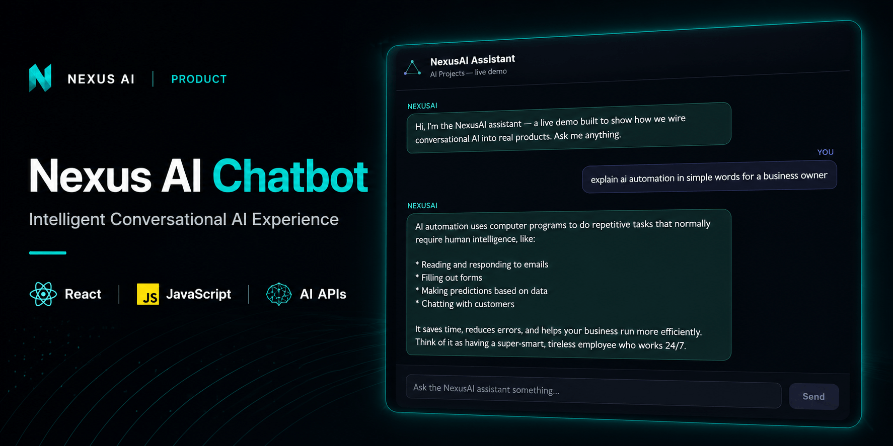
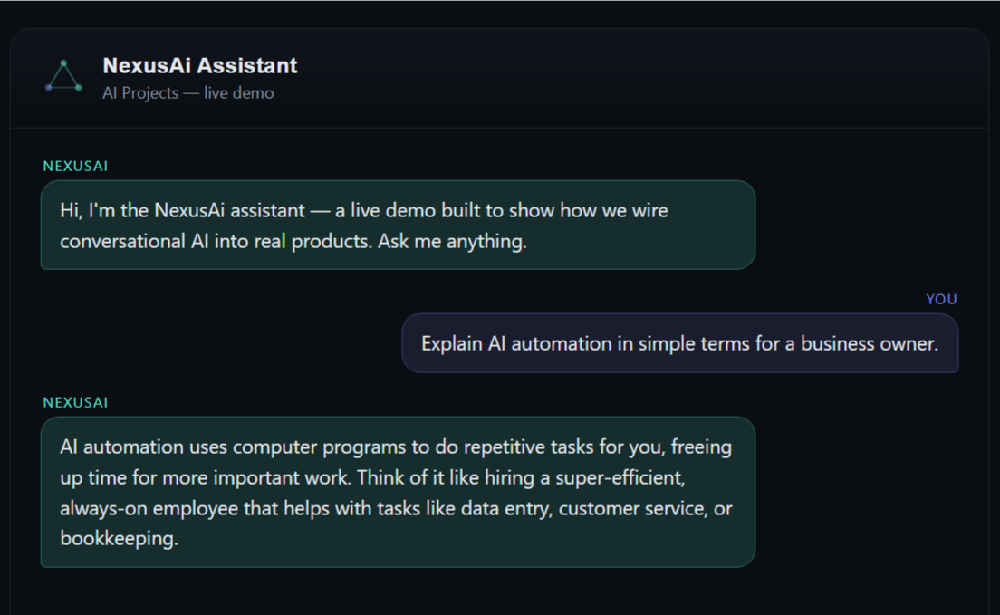
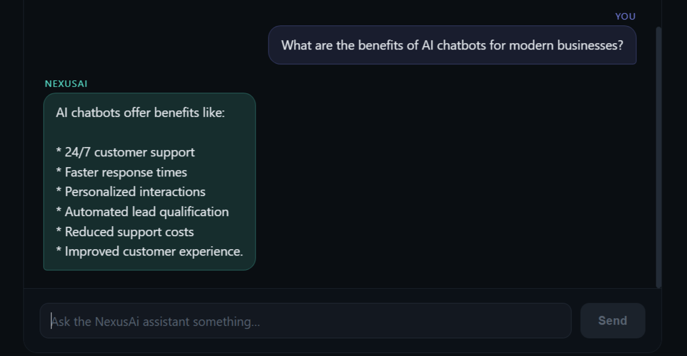
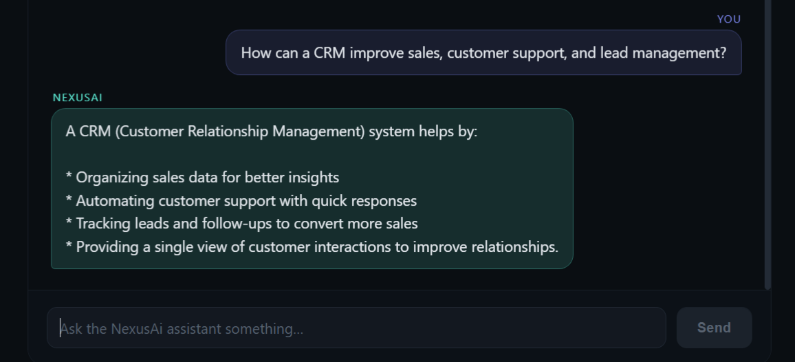

<p align="center">
  
</p>

# Nexus AI Chatbot

A modern AI chatbot built with **React**, **Vite**, **Groq API**, and **Vercel Serverless Functions**.

The project demonstrates a secure AI integration architecture where a React frontend communicates with a Large Language Model through a serverless backend, ensuring API credentials remain protected.

**Live Demo**

https://nexus-ai-chatbot-kappa.vercel.app/

---

## Features

- AI-powered conversational interface
- Secure Groq API integration
- React 18 frontend
- Vite development environment
- Vercel Serverless Functions
- Responsive user interface
- Loading and error state handling
- Environment variable support
- Production-ready deployment on Vercel

---

## Architecture

```text
React Frontend
      │
      ▼
POST /api/chat
      │
      ▼
Vercel Serverless Function
      │
      ▼
Groq API
      │
      ▼
Llama 3.3 70B Versatile
      │
      ▼
AI Response
```

---

## Tech Stack

| Technology | Purpose |
|------------|---------|
| React 18 | User Interface |
| JavaScript (ES6+) | Application Logic |
| HTML5 | Document Structure |
| CSS (Inline Styles) | User Interface Styling |
| Vite 5 | Development & Build Tool |
| Groq API | Large Language Model |
| Vercel Functions | Secure Backend |
| Vercel | Deployment |

---

## Project Structure

```text
NEXUS-AI-CHATBOT/
├── api/
│   └── chat.js
├── assets/
│   └── screenshots/
│       ├── chatbot-home.png
│       ├── chatbot-ai-automation.png
│       └── chatbot-crm-assistance.png
├── src/
│   ├── App.jsx
│   └── main.jsx
├── .env.example
├── .gitignore
├── LICENSE
├── README.md
├── index.html
├── package.json
└── vite.config.js
```

---

## Key Components

| File | Description |
|------|-------------|
| `src/App.jsx` | Chat interface, state management, conversation flow, and UI rendering |
| `src/main.jsx` | React application entry point |
| `api/chat.js` | Serverless API route that securely communicates with the Groq API |
| `index.html` | Root HTML template |
| `package.json` | Project metadata, scripts, and dependencies |
| `vite.config.js` | Vite configuration |

---

## Screenshots

### Home

<p align="center">

</p>

### AI Automation

<p align="center">

</p>

### CRM Assistance

<p align="center">

</p>

---

## Local Development

Clone the repository.

```bash
git clone https://github.com/aazmirkhan/NEXUS-AI-CHATBOT.git
cd NEXUS-AI-CHATBOT
```

Install dependencies.

```bash
npm install
```

Create a local environment file.

```env
GROQ_API_KEY=your_api_key
```

Start the development server.

```bash
npm run dev
```

Create a production build.

```bash
npm run build
```

Preview the production build.

```bash
npm run preview
```

---

## Security

API credentials are never exposed to the client.

All AI requests are processed through a Vercel Serverless Function using environment variables.

---

## License

Distributed under the MIT License.

---

## Author

**Aazmir Ali Khan**

BS Data Science Student • AI & Full-Stack Developer

GitHub  
https://github.com/aazmirkhan

LinkedIn  
https://www.linkedin.com/in/aazmiralikhan
